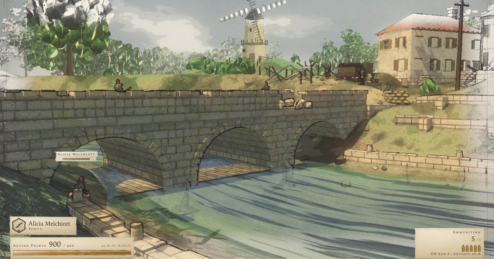

# Valkyrie Chronicles — a browser tactical RPG

A single-mission tactical RPG that runs in a web browser, drawn in the watercolour-on-paper
style of SEGA's CANVAS engine: ink contours over flat washes, a warm paper substrate, and a
page that drains toward its margins the way a plate in an illustrated history does.

**The mission is *The Bridge at Vasel*.** Squad 7 of the Gallian Militia has to take a river
crossing off an Imperial garrison before it can be demolished. You command the squad from an
overhead tactical map, then drop into third-person control of one soldier at a time to move,
take cover and shoot — spend command points, sortie, act, and end the turn.

Everything is generated at runtime: the terrain, the town, the foliage, the character rigs,
the textures and the audio. There are no art assets in this repository.



---

## Run it

```bash
npm install
npm run dev            # http://localhost:5173
```

## Build it

```bash
npm run build          # -> dist/, a single ~2 MB chunk (~620 kB gzipped)
npm run preview        # serve the built dist/
```

`dist/` is fully static and uses relative asset paths, so it can be served from a domain root
or from any sub-path.

## Requirements

- **WebGL2** and a desktop or laptop machine.
- **A keyboard and a mouse.** There is no touch input — on a phone or tablet the demo says so
  up front rather than pretending to work.
- Recent Chrome, Edge, Firefox or Safari, with hardware acceleration enabled.

The renderer sizes its drawing buffer to a fixed pixel budget at every window size, so it
targets 60 fps on a mid-range laptop GPU rather than a fixed resolution. The pause menu's
**Resolution** row overrides that if you would rather have the pixels than the frames.

## Controls

**Tactical map (command mode)**

| Key | Action |
|---|---|
| Drag | Pan the map |
| LMB | Select a unit |
| Tab | Next soldier |
| Q | Orders |
| Enter | Sortie (take control of the selected soldier) |
| E | End turn |
| Esc | Pause |

**On the field (action mode)**

| Key | Action |
|---|---|
| WASD | Move |
| Shift | Sprint |
| Ctrl | Crouch |
| RMB / Q | Aim |
| LMB | Fire |
| R | Reload |
| Enter | End this soldier's action |
| Esc | Pause |

**Aiming**

| Key | Action |
|---|---|
| LMB | Fire |
| RMB / Q | Lower weapon |
| Wheel | Magnify |
| Tab | Target a body part |
| Esc | Pause |

## Tech

- **three.js r185**, and nothing else at runtime — no other dependency ships in the bundle.
- ~65,000 lines across 61 ES modules: a custom NPR render pipeline (G-buffer contour prepass,
  banded diffuse, watercolour grade), a procedural world generator, a fixed-step physics and
  ballistics layer, a turn-based battle system with AI, a DOM HUD, and a fully procedural
  audio engine (music state machine, positional SFX, convolution reverb) built on Web Audio.
- Vite for dev and build; Playwright only as a dev dependency, for the screenshot harness.

## Development

`docs/RESUME.md` is the runbook, `docs/ARCHITECTURE.md` is the module map, and
`docs/CRITIQUE_RUBRIC.md` is the record of what has been tried and ruled out. The visual work
runs as a render → critique → fix loop driven by `tools/shoot.mjs`:

```bash
node tools/shoot.mjs bridge        # ~1.6 s, resident render daemon
node tools/shoot.mjs --cold tank   # ~10 s, byte-deterministic, for numbers you quote
node tools/shoot.mjs --list        # the twelve shot names
```

Useful query parameters: `?debug` (dev handles and the raw stack on a crash), `?q=0|1|2`
(quality tier), `?px=<pixels>` (drawing-buffer budget), `?rs=<n>` (manual resolution scale),
`?seed=<n>`.

## Credits and disclaimer

Built by **Jake Verbaten** in three.js.

This is a **fan-made, non-commercial technical demo**. It is not affiliated with, endorsed by
or connected to SEGA. *Valkyria Chronicles*, the CANVAS engine, and the characters, units and
setting this demo pays tribute to are the property of SEGA Corporation. No SEGA assets — no
art, audio, model or text — are used or redistributed here; everything in this repository is
generated from code. The demo's own code is MIT-licensed; the trademarks are not mine to give.

If you are the rights holder and would like this taken down, open an issue.
